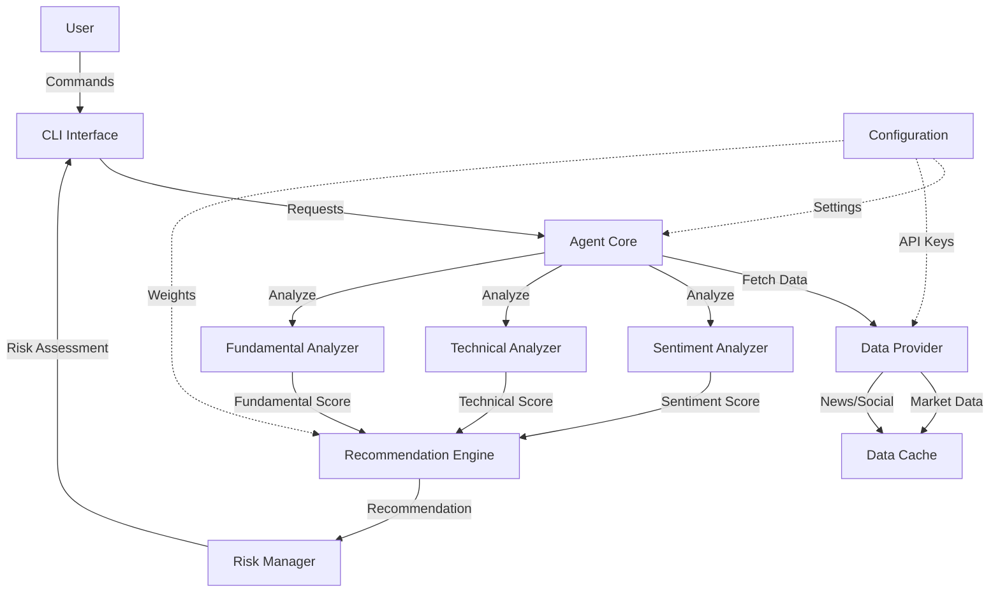

# Design Document: Stock Market AI Agent

## Overview

The Stock Market AI Agent is a command-line application that provides trading recommendations by analyzing market sentiment, technical indicators, and fundamental metrics. The system follows a modular architecture with specialized analyzers that feed into a recommendation engine, prioritizing sentiment analysis as the primary signal while using technical and fundamental analysis for validation.

The agent operates as a personal trading assistant, fetching data from external APIs, processing it through multiple analysis pipelines, and presenting actionable recommendations through an interactive CLI. The design emphasizes extensibility, allowing users to configure analysis weights and add new data sources or analysis methods.

## Architecture

### High-Level Architecture



### Component Responsibilities

**CLI Interface**: Handles user input, command parsing, output formatting, and displays disclaimers.

**Agent Core**: The main orchestration layer that coordinates the entire analysis workflow. It receives requests from the CLI, invokes the Data Provider to fetch required data, dispatches data to the appropriate analyzers (Sentiment, Technical, Fundamental) in parallel, collects their results, passes them to the Recommendation Engine, invokes the Risk Manager for risk assessment, and returns the complete analysis back to the CLI. It also handles the overall error handling strategy and manages component lifecycle.

**Data Provider**: Fetches data from external APIs (market data, news, social media), implements caching, retry logic, and rate limiting.

**Sentiment Analyzer**: Processes news articles and social media posts, extracts sentiment scores, aggregates multiple sources, and detects sentiment shifts.

**Technical Analyzer**: Calculates technical indicators (moving averages, RSI, MACD), identifies chart patterns, and determines support/resistance levels.

**Fundamental Analyzer**: Retrieves company financials, calculates financial ratios, compares against industry benchmarks, and assesses earnings data.

**Recommendation Engine**: Combines analysis results using configured weights, generates buy/sell/hold recommendations, calculates confidence scores, and provides reasoning.

**Risk Manager**: Assesses portfolio risk, suggests position sizing, identifies concentration and correlation risks, and recommends risk mitigation actions.

**Configuration**: Manages user preferences, API credentials, analysis weights, and risk tolerance settings.

**Data Cache**: Stores recently fetched data with TTL (time-to-live) to reduce API calls and improve response times.

## Components and Interfaces

### Data Models

```python
@dataclass
class StockData:
    symbol: str
    current_price: float
    volume: int
    timestamp: datetime
    historical_prices: List[PricePoint]  # 200+ days

@dataclass
class PricePoint:
    date: datetime
    open: float
    high: float
    low: float
    close: float
    volume: int

@dataclass
class SentimentData:
    symbol: str
    sentiment_score: float  # -1.0 to +1.0
    confidence: float  # 0.0 to 1.0
    sources: List[SentimentSource]
    timestamp: datetime

@dataclass
class SentimentSource:
    source_type: str  # "news" or "social"
    content: str
    score: float
    timestamp: datetime
    url: Optional[str]

@dataclass
class TechnicalIndicators:
    symbol: str
    ma_20: float
    ma_50: float
    ma_200: float
    rsi: float
    macd: float
    macd_signal: float
    support_levels: List[float]
    resistance_levels: List[float]
    technical_score: float  # -1.0 to +1.0

@dataclass
class FundamentalMetrics:
    symbol: str
    pe_ratio: Optional[float]
    pb_ratio: Optional[float]
    debt_to_equity: Optional[float]
    eps: Optional[float]
    revenue_growth: Optional[float]
    industry_avg_pe: Optional[float]
    fundamental_score: float  # -1.0 to +1.0

@dataclass
class Recommendation:
    symbol: str
    action: str  # "BUY", "SELL", "HOLD"
    confidence: float  # 0.0 to 1.0
    entry_price_low: Optional[float]
    entry_price_high: Optional[float]
    exit_price_low: Optional[float]
    exit_price_high: Optional[float]
    reasoning: str
    sentiment_contribution: float
    technical_contribution: float
    fundamental_contribution: float
    timestamp: datetime

@dataclass
class RiskAssessment:
    portfolio_risk_score: float  # 0.0 to 1.0
    concentration_risks: List[ConcentrationRisk]
    correlation_risks: List[CorrelationRisk]
    suggested_position_size: float  # percentage of portfolio
    risk_mitigation_actions: List[str]

@dataclass
class Position:
    symbol: str
    shares: int
    avg_cost: float
    current_value: float
    weight: float  # percentage of portfolio

@dataclass
class Configuration:
    api_keys: Dict[str, str]
    risk_tolerance: str  # "conservative", "moderate", "aggressive"
    sentiment_weight: float
    technical_weight: float
    fundamental_weight: float
    cache_ttl_seconds: int
```

### Component Interfaces

#### Data Provider Interface

```python
class DataProvider:
    def get_stock_data(self, symbol: str) -> StockData:
        """Fetch current and historical stock data"""
        
    def get_news(self, symbol: str, days: int = 7) -> List[NewsArticle]:
        """Fetch news articles for the past N days"""
        
    def get_social_media(self, symbol: str, hours: int = 24) -> List[SocialPost]:
        """Fetch social media posts for the past N hours"""
        
    def get_company_financials(self, symbol: str) -> CompanyFinancials:
        """Fetch company financial data"""
```

#### Sentiment Analyzer Interface

```python
class SentimentAnalyzer:
    def analyze_news(self, articles: List[NewsArticle]) -> List[SentimentSource]:
        """Extract sentiment from news articles"""
        
    def analyze_social(self, posts: List[SocialPost]) -> List[SentimentSource]:
        """Extract sentiment from social media posts"""
        
    def aggregate_sentiment(self, sources: List[SentimentSource]) -> SentimentData:
        """Combine multiple sentiment sources into overall score"""
        
    def detect_sentiment_shift(self, current: SentimentData, previous: SentimentData) -> bool:
        """Detect significant sentiment changes"""
```

#### Technical Analyzer Interface

```python
class TechnicalAnalyzer:
    def calculate_moving_averages(self, prices: List[PricePoint]) -> Dict[str, float]:
        """Calculate 20, 50, 200-day moving averages"""
        
    def calculate_rsi(self, prices: List[PricePoint], period: int = 14) -> float:
        """Calculate Relative Strength Index"""
        
    def calculate_macd(self, prices: List[PricePoint]) -> Tuple[float, float]:
        """Calculate MACD and signal line"""
        
    def find_support_resistance(self, prices: List[PricePoint]) -> Tuple[List[float], List[float]]:
        """Identify support and resistance levels"""
        
    def generate_technical_score(self, indicators: TechnicalIndicators) -> float:
        """Generate overall technical score from indicators"""
```

#### Fundamental Analyzer Interface

```python
class FundamentalAnalyzer:
    def calculate_ratios(self, financials: CompanyFinancials) -> FundamentalMetrics:
        """Calculate P/E, P/B, debt-to-equity ratios"""
        
    def compare_to_industry(self, metrics: FundamentalMetrics, industry: str) -> FundamentalMetrics:
        """Compare metrics against industry averages"""
        
    def generate_fundamental_score(self, metrics: FundamentalMetrics) -> float:
        """Generate overall fundamental score"""
```

#### Recommendation Engine Interface

```python
class RecommendationEngine:
    def generate_recommendation(
        self,
        sentiment: SentimentData,
        technical: TechnicalIndicators,
        fundamental: FundamentalMetrics,
        config: Configuration
    ) -> Recommendation:
        """Generate trading recommendation from all analyses"""
        
    def calculate_confidence(
        self,
        sentiment: SentimentData,
        technical: TechnicalIndicators,
        fundamental: FundamentalMetrics
    ) -> float:
        """Calculate confidence score for recommendation"""
        
    def suggest_price_range(
        self,
        action: str,
        current_price: float,
        technical: TechnicalIndicators
    ) -> Tuple[float, float]:
        """Suggest entry/exit price range"""
```

#### Risk Manager Interface

```python
class RiskManager:
    def assess_portfolio_risk(self, positions: List[Position]) -> RiskAssessment:
        """Calculate overall portfolio risk"""
        
    def suggest_position_size(
        self,
        symbol: str,
        portfolio_value: float,
        stock_volatility: float,
        risk_tolerance: str
    ) -> float:
        """Suggest position size as percentage of portfolio"""
        
    def identify_concentration_risk(self, positions: List[Position]) -> List[ConcentrationRisk]:
        """Identify positions exceeding concentration thresholds"""
        
    def identify_correlation_risk(self, positions: List[Position]) -> List[CorrelationRisk]:
        """Identify correlated positions"""
```

### Agent Core Implementation

The Agent Core is implemented as a central coordinator class that manages the analysis pipeline:

```python
class AgentCore:
    def __init__(self, config: Configuration):
        self.config = config
        self.data_provider = DataProvider(config)
        self.sentiment_analyzer = SentimentAnalyzer()
        self.technical_analyzer = TechnicalAnalyzer()
        self.fundamental_analyzer = FundamentalAnalyzer()
        self.recommendation_engine = RecommendationEngine(config)
        self.risk_manager = RiskManager(config)
    
    def analyze_stock(self, symbol: str) -> AnalysisResult:
        """Main entry point for stock analysis"""
        # 1. Fetch all required data
        stock_data = self.data_provider.get_stock_data(symbol)
        news = self.data_provider.get_news(symbol)
        social = self.data_provider.get_social_media(symbol)
        financials = self.data_provider.get_company_financials(symbol)
        
        # 2. Run analyses in parallel (using threading or async)
        sentiment = self.sentiment_analyzer.analyze(news, social)
        technical = self.technical_analyzer.analyze(stock_data)
        fundamental = self.fundamental_analyzer.analyze(financials, stock_data)
        
        # 3. Generate recommendation
        recommendation = self.recommendation_engine.generate_recommendation(
            sentiment, technical, fundamental, self.config
        )
        
        # 4. Assess risk if portfolio provided
        risk_assessment = None
        if self.config.portfolio:
            risk_assessment = self.risk_manager.assess_new_position(
                symbol, stock_data, recommendation, self.config.portfolio
            )
        
        return AnalysisResult(
            symbol=symbol,
            sentiment=sentiment,
            technical=technical,
            fundamental=fundamental,
            recommendation=recommendation,
            risk_assessment=risk_assessment
        )
```

The Agent Core handles:
- **Component initialization** with configuration
- **Data orchestration** by calling Data Provider for all required data
- **Parallel execution** of independent analyzers to improve performance
- **Error propagation** from components to the CLI layer
- **Result aggregation** into a unified analysis result
- **Optional features** like risk assessment based on configuration

### Analysis Workflow

The agent follows this workflow when analyzing a stock:

1. **Data Acquisition Phase**
   - Fetch stock data (current price, historical prices)
   - Fetch news articles (past 7 days)
   - Fetch social media posts (past 24 hours)
   - Fetch company financials
   - Cache all data with 5-minute TTL

2. **Parallel Analysis Phase**
   - Sentiment Analyzer processes news and social media
   - Technical Analyzer calculates indicators from price data
   - Fundamental Analyzer calculates ratios from financials
   - Each analyzer produces a normalized score (-1.0 to +1.0)

3. **Recommendation Generation Phase**
   - Recommendation Engine combines scores using configured weights
   - Default weights: Sentiment 50%, Technical 30%, Fundamental 20%
   - Generate action (BUY/SELL/HOLD) based on combined score
   - Calculate confidence based on agreement between analyzers
   - Suggest price ranges using technical support/resistance

4. **Risk Assessment Phase**
   - Risk Manager evaluates recommendation against portfolio
   - Calculate suggested position size
   - Identify potential risks
   - Provide risk mitigation recommendations

5. **Presentation Phase**
   - CLI formats and displays results
   - Show recommendation with reasoning
   - Display risk assessment
   - Include disclaimers

### Sentiment Analysis Algorithm

The sentiment analyzer uses a multi-step process combining natural language processing with financial domain knowledge:

#### 1. Text Preprocessing

```python
def preprocess_text(text: str) -> List[str]:
    # Remove URLs, mentions, hashtags
    text = re.sub(r'http\S+|@\w+|#\w+', '', text)
    # Remove special characters but keep financial symbols ($, %)
    text = re.sub(r'[^\w\s$%.]', '', text)
    # Tokenize into words
    tokens = word_tokenize(text.lower())
    # Remove stop words (but keep financial terms like "buy", "sell")
    tokens = [t for t in tokens if t not in stop_words or t in financial_terms]
    # Lemmatize (running -> run, better -> good)
    tokens = [lemmatizer.lemmatize(t) for t in tokens]
    return tokens
```

#### 2. Sentiment Extraction Using Pre-trained Model

The system uses **FinBERT** (Financial BERT), a BERT model fine-tuned on financial text:

```python
def extract_sentiment(text: str) -> Tuple[float, float]:
    # Preprocess text
    tokens = preprocess_text(text)
    processed_text = ' '.join(tokens)
    
    # Use FinBERT model for sentiment classification
    # Returns: positive, negative, neutral probabilities
    result = finbert_model(processed_text)
    
    # Convert to sentiment score: -1.0 (negative) to +1.0 (positive)
    sentiment_score = result['positive'] - result['negative']
    
    # Confidence is the maximum probability
    confidence = max(result['positive'], result['negative'], result['neutral'])
    
    return sentiment_score, confidence
```

**Why FinBERT?**
- Trained specifically on financial news and reports
- Understands financial terminology and context
- Better than general sentiment models for stock analysis
- Open source and can run locally (no API costs)

#### 3. Temporal Weighting

Recent content is more relevant for trading decisions:

```python
def calculate_temporal_weight(timestamp: datetime) -> float:
    age_hours = (datetime.now() - timestamp).total_seconds() / 3600
    
    if age_hours > 24:
        return 0.0  # Exclude old content
    elif age_hours < 6:
        return 1.0  # Full weight for very recent
    else:
        # Exponential decay: weight = e^(-age/12)
        return math.exp(-age_hours / 12)
```

#### 4. Source Weighting

Different sources have different reliability:

```python
def calculate_source_weight(source: SentimentSource) -> float:
    base_weights = {
        'news': 1.0,        # Professional journalism
        'social': 0.5,      # Social media posts
    }
    
    weight = base_weights[source.source_type]
    
    # Boost for verified/credible sources
    if source.is_verified:
        weight *= 1.5
    
    # Boost for high-engagement content (viral posts often signal trends)
    if source.engagement_score > 1000:
        weight *= 1.2
    
    return weight
```

#### 5. Aggregation

Combine all sentiment sources into a single score:

```python
def aggregate_sentiment(sources: List[SentimentSource]) -> SentimentData:
    if len(sources) < 5:
        # Low confidence with few sources
        confidence_penalty = 0.5
    else:
        confidence_penalty = 1.0
    
    weighted_scores = []
    weighted_confidences = []
    
    for source in sources:
        temporal_weight = calculate_temporal_weight(source.timestamp)
        source_weight = calculate_source_weight(source)
        
        total_weight = temporal_weight * source_weight
        
        weighted_scores.append(source.score * total_weight)
        weighted_confidences.append(source.confidence * total_weight)
    
    # Weighted average
    total_weight = sum(weighted_scores)
    sentiment_score = sum(weighted_scores) / total_weight if total_weight > 0 else 0.0
    confidence = sum(weighted_confidences) / total_weight * confidence_penalty
    
    # Clamp to valid range
    sentiment_score = max(-1.0, min(1.0, sentiment_score))
    confidence = max(0.0, min(1.0, confidence))
    
    return SentimentData(
        symbol=symbol,
        sentiment_score=sentiment_score,
        confidence=confidence,
        sources=sources,
        timestamp=datetime.now()
    )
```

#### 6. Shift Detection

Detect significant sentiment changes:

```python
def detect_sentiment_shift(current: SentimentData, previous: SentimentData) -> bool:
    # Check if data is from within 24 hours
    time_diff = (current.timestamp - previous.timestamp).total_seconds() / 3600
    if time_diff > 24:
        return False
    
    # Check if change exceeds threshold
    score_change = abs(current.sentiment_score - previous.sentiment_score)
    return score_change > 0.3
```

#### Example Sentiment Analysis Flow

```
Input: "AAPL" stock symbol

1. Fetch Data:
   - 50 news articles from past 7 days
   - 200 social media posts from past 24 hours

2. Process Each Item:
   Article 1: "Apple announces record earnings..."
   → Preprocess → "apple announce record earning"
   → FinBERT → positive: 0.85, negative: 0.05, neutral: 0.10
   → Sentiment: +0.80, Confidence: 0.85
   → Temporal weight: 1.0 (2 hours old)
   → Source weight: 1.0 (news)
   → Final weight: 0.80 * 1.0 * 1.0 = 0.80

3. Aggregate:
   - 50 articles: avg sentiment +0.45
   - 200 posts: avg sentiment +0.62
   - Combined weighted average: +0.51
   - Overall confidence: 0.78

4. Result:
   SentimentData(
     symbol="AAPL",
     sentiment_score=0.51,
     confidence=0.78,
     sources=[...],
     timestamp=now
   )
```

This approach provides:
- **Domain-specific accuracy** through FinBERT
- **Recency bias** through temporal weighting
- **Source reliability** through source weighting
- **Confidence calibration** based on data quantity and quality
- **Trend detection** through shift analysis

### Technical Analysis Algorithm

The technical analyzer implements standard indicators:

1. **Moving Averages**
   - Simple Moving Average (SMA) for 20, 50, 200 days
   - Bullish signal: price > MA and short MA > long MA
   - Bearish signal: price < MA and short MA < long MA

2. **RSI (Relative Strength Index)**
   - Calculate 14-period RSI
   - Overbought: RSI > 70 (bearish signal)
   - Oversold: RSI < 30 (bullish signal)
   - Neutral: 30 <= RSI <= 70

3. **MACD (Moving Average Convergence Divergence)**
   - MACD line = 12-day EMA - 26-day EMA
   - Signal line = 9-day EMA of MACD
   - Bullish: MACD crosses above signal
   - Bearish: MACD crosses below signal

4. **Support/Resistance**
   - Identify local minima (support) and maxima (resistance)
   - Use clustering to find significant levels
   - Consider volume at price levels

5. **Technical Score Calculation**
   - Assign points for each bullish/bearish signal
   - Normalize to -1.0 (very bearish) to +1.0 (very bullish)
   - Weight indicators: MA (30%), RSI (30%), MACD (40%)

### Recommendation Logic

The recommendation engine uses this decision tree:

```
Combined Score = (sentiment * w_s) + (technical * w_t) + (fundamental * w_f)

If Combined Score > 0.3:
    Action = BUY
    Confidence = min(sentiment_confidence, technical_confidence, fundamental_confidence)
    Entry Range = [current_price * 0.98, current_price * 1.02]
    
Else If Combined Score < -0.3:
    Action = SELL
    Confidence = min(sentiment_confidence, technical_confidence, fundamental_confidence)
    Exit Range = [current_price * 0.98, current_price * 1.02]
    
Else:
    Action = HOLD
    Confidence = 1.0 - abs(Combined Score) / 0.3
    Price Range = None

If sentiment, technical, fundamental disagree (std dev > 0.5):
    Reduce Confidence by 30%
    Add conflict warning to reasoning
```


## Correctness Properties

A property is a characteristic or behavior that should hold true across all valid executions of a system—essentially, a formal statement about what the system should do. Properties serve as the bridge between human-readable specifications and machine-verifiable correctness guarantees.

### Property 1: Sentiment Extraction Completeness

*For any* collection of news articles or social media posts about a stock, the Sentiment_Analyzer should extract a sentiment score from each item in the collection.

**Validates: Requirements 1.1, 1.2**

### Property 2: Sentiment Score Range Validity

*For any* set of sentiment sources, when aggregated, the resulting sentiment score should always be within the range [-1.0, 1.0] inclusive.

**Validates: Requirements 1.3**

### Property 3: Temporal Filtering of Sentiment Data

*For any* sentiment data with timestamps, only data with timestamps within the past 24 hours should be included in the current analysis.

**Validates: Requirements 1.4**

### Property 4: Sentiment Confidence Presence

*For any* sentiment analysis result, a confidence level should always be present and within the range [0.0, 1.0].

**Validates: Requirements 1.5**

### Property 5: Sentiment Shift Detection

*For any* pair of sentiment scores (current and previous) where the absolute difference exceeds 0.3, the system should flag this as a significant sentiment shift.

**Validates: Requirements 1.6**

### Property 6: Moving Average Calculation

*For any* historical price data with at least 200 data points, the Technical_Analyzer should calculate 20-day, 50-day, and 200-day moving averages.

**Validates: Requirements 2.1**

### Property 7: RSI Calculation

*For any* price data with sufficient history (at least 14 periods), the Technical_Analyzer should calculate an RSI value between 0 and 100.

**Validates: Requirements 2.2**

### Property 8: MACD Calculation

*For any* price data with sufficient history (at least 26 periods), the Technical_Analyzer should calculate MACD and signal line values.

**Validates: Requirements 2.3**

### Property 9: Support and Resistance Identification

*For any* price and volume data, the Technical_Analyzer should identify at least one support level and one resistance level (or indicate none found).

**Validates: Requirements 2.4**

### Property 10: Pattern Identification

*For any* set of calculated technical indicators, the Technical_Analyzer should identify the pattern as either bullish, bearish, or neutral.

**Validates: Requirements 2.5**

### Property 11: Technical Score Generation

*For any* set of technical indicators (including conflicting ones), the Technical_Analyzer should produce a weighted technical score within the range [-1.0, 1.0].

**Validates: Requirements 2.6**

### Property 12: P/E Ratio Calculation

*For any* company financial data containing price and earnings information, the Fundamental_Analyzer should calculate a P/E ratio or indicate it's unavailable.

**Validates: Requirements 3.1**

### Property 13: P/B Ratio Calculation

*For any* company financial data containing price and book value information, the Fundamental_Analyzer should calculate a P/B ratio or indicate it's unavailable.

**Validates: Requirements 3.2**

### Property 14: Debt-to-Equity Ratio Calculation

*For any* company financial data containing debt and equity information, the Fundamental_Analyzer should calculate a debt-to-equity ratio or indicate it's unavailable.

**Validates: Requirements 3.3**

### Property 15: Earnings Data Extraction

*For any* earnings report, the Fundamental_Analyzer should extract EPS and revenue growth values or indicate they're unavailable.

**Validates: Requirements 3.4**

### Property 16: Industry Comparison

*For any* calculated fundamental metrics with available industry data, the Fundamental_Analyzer should compare them against industry averages.

**Validates: Requirements 3.5**

### Property 17: Incomplete Data Indication

*For any* fundamental analysis with missing data fields, the Fundamental_Analyzer should explicitly indicate which metrics are unavailable.

**Validates: Requirements 3.6**

### Property 18: Recommendation Generation

*For any* complete set of sentiment, technical, and fundamental analyses, the Recommendation_Engine should generate exactly one recommendation from the set {BUY, SELL, HOLD}.

**Validates: Requirements 4.1**

### Property 19: Price Range for Actionable Recommendations

*For any* recommendation that is BUY or SELL, the Recommendation_Engine should provide an entry or exit price range with both low and high values.

**Validates: Requirements 4.2, 4.3**

### Property 20: Recommendation Confidence Range

*For any* generated recommendation, the confidence score should be within the range [0.0, 1.0].

**Validates: Requirements 4.4**

### Property 21: Bullish Signal Recommendation

*For any* analysis where sentiment score > 0.5 and technical indicators are bullish, the Recommendation_Engine should generate a BUY recommendation.

**Validates: Requirements 4.5**

### Property 22: Bearish Signal Recommendation

*For any* analysis where sentiment score < -0.5 and technical indicators are bearish, the Recommendation_Engine should generate a SELL recommendation.

**Validates: Requirements 4.6**

### Property 23: Conflicting Signal Resolution

*For any* analysis where sentiment, technical, and fundamental scores have a standard deviation > 0.5, the Recommendation_Engine should recommend HOLD and include a conflict explanation in the reasoning.

**Validates: Requirements 4.7**

### Property 24: Portfolio Risk Score Calculation

*For any* portfolio containing one or more positions, the Risk_Manager should calculate an overall risk score within the range [0.0, 1.0].

**Validates: Requirements 5.1**

### Property 25: Position Size Suggestion

*For any* new position consideration with portfolio value and stock volatility, the Risk_Manager should suggest a position size as a percentage between 0.0 and 100.0.

**Validates: Requirements 5.2**

### Property 26: Concentration Risk Detection

*For any* portfolio where a single position exceeds 20% of total portfolio value, the Risk_Manager should flag a concentration risk for that position.

**Validates: Requirements 5.3**

### Property 27: Correlation Risk Identification

*For any* portfolio containing multiple positions, the Risk_Manager should identify correlated positions (or indicate none found).

**Validates: Requirements 5.4**

### Property 28: Volatility Impact on Position Sizing

*For any* two position sizing calculations with identical parameters except volatility, the position with higher volatility should receive a smaller or equal suggested position size.

**Validates: Requirements 5.5**

### Property 29: Risk Threshold Recommendations

*For any* portfolio where the risk score exceeds the user-defined risk tolerance threshold, the Risk_Manager should provide at least one risk reduction recommendation.

**Validates: Requirements 5.6**

### Property 30: Stock Data Retrieval

*For any* valid stock symbol query, the Data_Provider should retrieve current price and volume data or return an error indicating the symbol is invalid.

**Validates: Requirements 6.1**

### Property 31: Historical Data Minimum Length

*For any* successful historical data retrieval, the returned price history should contain at least 200 data points.

**Validates: Requirements 6.2**

### Property 32: News Data Temporal Bounds

*For any* news data retrieval, all returned articles should have timestamps within the past 7 days.

**Validates: Requirements 6.3**

### Property 33: Social Media Data Temporal Bounds

*For any* social media data retrieval, all returned posts should have timestamps within the past 24 hours.

**Validates: Requirements 6.4**

### Property 34: Retry Logic with Exponential Backoff

*For any* data retrieval failure, the Data_Provider should retry up to 3 times with exponentially increasing delays between attempts.

**Validates: Requirements 6.5**

### Property 35: Data Caching Behavior

*For any* successfully retrieved data, subsequent requests for the same data within 5 minutes should return cached data without making new API calls.

**Validates: Requirements 6.6**

### Property 36: Command Output Completeness

*For any* valid CLI command (analyze, recommend, sentiment), the CLI should display output containing the requested information for the specified stock symbol.

**Validates: Requirements 7.2, 7.3, 7.5**

### Property 37: Invalid Input Error Handling

*For any* invalid CLI input, the CLI should display an error message that includes correct usage examples.

**Validates: Requirements 7.6**

### Property 38: Progress Indicator Display

*For any* analysis operation that takes longer than 1 second, the CLI should display progress indicators during execution.

**Validates: Requirements 7.7**

### Property 39: Recommendation Disclaimer Presence

*For any* displayed recommendation, the output should include a disclaimer stating it is not financial advice.

**Validates: Requirements 8.2**

### Property 40: Past Performance Warning

*For any* output displaying historical data or analysis, the Agent should include a warning that past performance does not guarantee future results.

**Validates: Requirements 8.3**

### Property 41: Professional Consultation Advisory

*For any* recommendation or risk assessment output, the Agent should advise users to consult with financial professionals.

**Validates: Requirements 8.4**

### Property 42: Risk Estimate Clarification

*For any* displayed risk assessment, the output should clarify that risk calculations are estimates.

**Validates: Requirements 8.5**

### Property 43: Error Message Appropriateness

*For any* error condition (invalid symbol, rate limit, network failure), the Agent should return an error message that clearly describes the problem and suggests remediation when applicable.

**Validates: Requirements 9.1, 9.2, 9.3**

### Property 44: Graceful Degradation

*For any* analysis where sentiment data is unavailable, the Agent should proceed with technical and fundamental analysis and indicate that sentiment analysis was skipped.

**Validates: Requirements 9.4**

### Property 45: Low Confidence Flagging

*For any* analysis result where data quality is poor (e.g., fewer than 5 sentiment sources), the Agent should flag the result as low confidence.

**Validates: Requirements 9.5**

### Property 46: Error Logging

*For any* critical error that occurs during execution, the Agent should create a log entry containing error details, timestamp, and context.

**Validates: Requirements 9.6**

### Property 47: Configuration Weight Validation

*For any* configuration setting for sentiment, technical, or fundamental analysis weights, the Agent should accept values in the range [0.0, 1.0] and reject values outside this range.

**Validates: Requirements 10.3, 10.4, 10.5**

### Property 48: Weight Normalization

*For any* set of configured weights (sentiment, technical, fundamental) that do not sum to 1.0, the Agent should automatically normalize them so they sum to 1.0.

**Validates: Requirements 10.6**

### Property 49: Configuration Persistence Round-Trip

*For any* valid configuration settings, saving the configuration and then loading it in a new session should produce equivalent configuration values.

**Validates: Requirements 10.7**

## Error Handling

The system implements a layered error handling strategy:

### Data Layer Errors

**Network Failures**: Retry with exponential backoff (3 attempts), then return error to user with clear message.

**API Rate Limits**: Detect rate limit responses, inform user of wait time, cache partial results.

**Invalid Symbols**: Validate symbols before API calls when possible, return clear "symbol not found" errors.

**Data Quality Issues**: Flag low-confidence results, proceed with available data, indicate missing components.

### Analysis Layer Errors

**Insufficient Data**: Skip analysis component if data is insufficient, proceed with other components, indicate what was skipped.

**Calculation Errors**: Log error details, return neutral/default values, flag low confidence.

**Timeout Errors**: Set reasonable timeouts for each analysis component (30 seconds), return partial results if available.

### Recommendation Layer Errors

**Conflicting Signals**: Recommend HOLD, explain conflict, reduce confidence score.

**Missing Analysis Components**: Generate recommendation from available components, indicate which were missing, reduce confidence.

### User Interface Errors

**Invalid Commands**: Display error with usage examples, suggest similar valid commands.

**Invalid Parameters**: Validate parameters, display specific error about what's wrong, show correct format.

### Logging Strategy

**Error Logs**: All errors logged with timestamp, component, error type, stack trace, and context.

**Info Logs**: API calls, cache hits/misses, analysis completion, recommendations generated.

**Debug Logs**: Detailed calculation steps, intermediate values, decision logic.

**Log Rotation**: Daily rotation, keep 30 days of logs, compress old logs.

## Testing Strategy

The Stock Market AI Agent will use a dual testing approach combining unit tests for specific examples and edge cases with property-based tests for universal correctness properties.

### Unit Testing Approach

Unit tests will focus on:

**Specific Examples**: Concrete test cases demonstrating correct behavior with known inputs and expected outputs.

**Edge Cases**: Boundary conditions such as empty data sets, single data points, extreme values, and minimum/maximum thresholds.

**Integration Points**: Interactions between components, data flow through the system, and end-to-end command execution.

**Error Conditions**: Specific error scenarios like network failures, invalid inputs, and missing data.

Example unit tests:
- Test sentiment analysis with a known news article and expected sentiment score
- Test RSI calculation with a specific price sequence and known RSI value
- Test recommendation generation with specific analysis scores and expected action
- Test CLI command parsing with various input formats

### Property-Based Testing Approach

Property-based tests will verify universal properties across randomized inputs using a property-based testing library (Hypothesis for Python, fast-check for TypeScript/JavaScript, QuickCheck for Haskell).

**Configuration**:
- Minimum 100 iterations per property test
- Each test tagged with: **Feature: stock-market-ai-agent, Property {number}: {property_text}**
- Random data generators for: stock symbols, price data, sentiment scores, financial metrics, portfolios

**Test Organization**:
- One property-based test per correctness property
- Tests grouped by component (Sentiment Analyzer, Technical Analyzer, etc.)
- Shared generators and fixtures for common data types

Example property tests:
- Property 2: Generate random sentiment sources, verify aggregated score is in [-1.0, 1.0]
- Property 28: Generate pairs of position sizing scenarios with different volatilities, verify inverse relationship
- Property 49: Generate random configurations, save and load, verify equivalence

### Testing Libraries

**Python**: 
- pytest for test framework
- Hypothesis for property-based testing
- unittest.mock for mocking external APIs

**TypeScript/JavaScript**:
- Jest for test framework
- fast-check for property-based testing
- nock for HTTP mocking

### Test Coverage Goals

- Unit test coverage: 80% of code lines
- Property test coverage: 100% of correctness properties
- Integration test coverage: All CLI commands and workflows
- Error handling coverage: All error paths tested

### Continuous Testing

- Run unit tests on every commit
- Run property tests on every pull request
- Run integration tests before deployment
- Monitor test execution time and optimize slow tests
